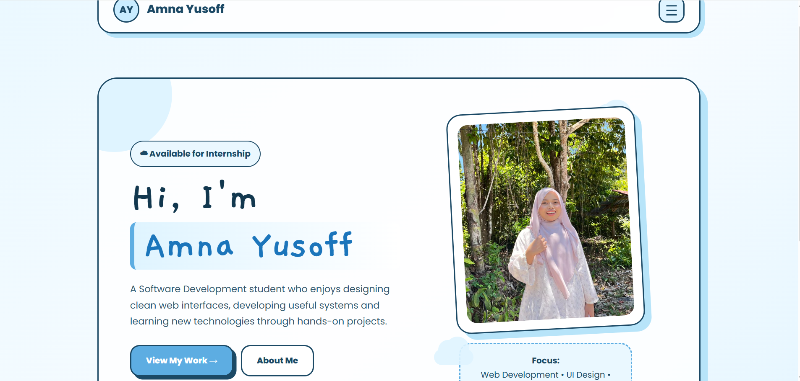
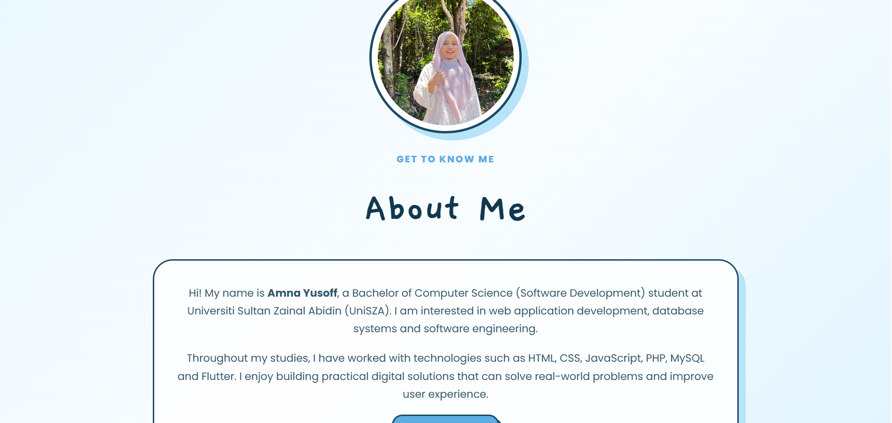
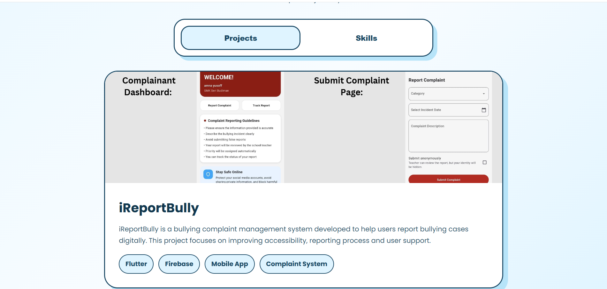
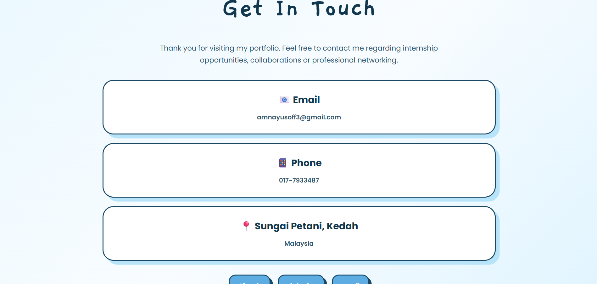

# Personal Portfolio Website

## Description

This project is a personal portfolio website developed to showcase my academic background, technical skills, software development projects, and contact information.

The portfolio serves as an online platform to present my work, achievements, and internship readiness as a final-year Bachelor of Computer Science (Software Development) student.

---

## Features

- Responsive Home Page
- About Me Section
- Download CV Feature
- Portfolio Showcase
- Project Display
- Skills Showcase
- Contact Information Page
- Mobile-Friendly Navigation
- GitHub Pages Deployment

---

## Technologies Used

- HTML5
- CSS3
- JavaScript

---

## Screenshots

### Home Page

### About Page

### Portfolio Showcase

### Contact Page

---

## Project Showcase

### iReportBully

A web-based bullying reporting system developed using CodeIgniter 4.

**Features:**

- Student complaint submission
- Complaint tracking
- Admin management
- Bullying report records
- User authentication

**Technology:**

- CodeIgniter 4
- PHP
- MySQL
- HTML
- CSS
- JavaScript

---

## Skills Showcase

Technical skills included in this portfolio:

- HTML
- CSS
- JavaScript
- PHP
- MySQL
- CodeIgniter 4
- Python
- Firebase
- Git & GitHub

---

## How to Run the Project

1. Download or clone this repository.
2. Open the project folder in Visual Studio Code.
3. Open `index.html`.
4. Run using Live Server or open directly in a web browser.
5. Navigate through Home, About, Portfolio and Contact sections.

---

## Demo Link

### GitHub Repository

https://github.com/amnayusoff/personal-blog-portfolio

### Live Website (GitHub Pages)

https://amnayusoff.github.io/personal-blog-portfolio/

---

## Author

**Amna Yusoff**

Bachelor of Computer Science (Software Development)

Universiti Sultan Zainal Abidin (UniSZA)